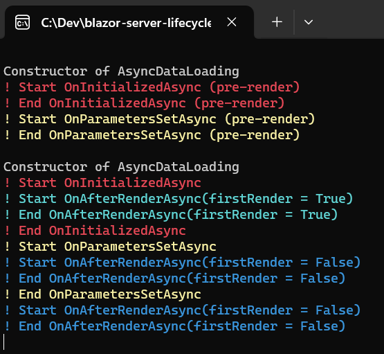

# blazor-server-lifecycle-examples-and-demos

## How to use

- run the project
- open /lifecycledemos/async-data-loading, 
- make sure to observe the console output while playing around with varous settings

Aims to explore and uncover various lifecycle nuances for blazor-server.

- spotlight asynchronous nature of the lifecyle
- lifecycle is not what you often expected 
- pre-rendering magic and nonsense
- component initialization firing twice (once for pre-render, and then once the socket connection is established)
- flashing and blinking while page components load

